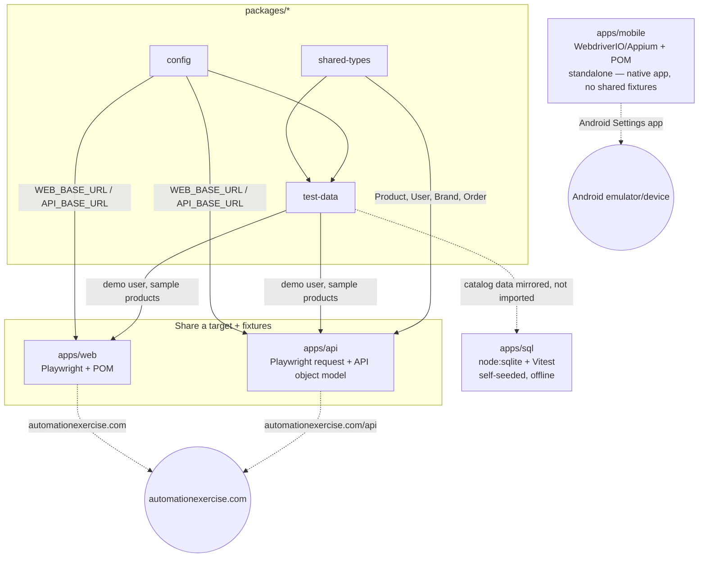

# Architecture

This document explains *why* the framework is structured the way it is. For *how to run it*, see `README.md`. For AI-assistant editing conventions, see `CLAUDE.md`.

## Why npm workspaces, not a single package

Playwright Test, WebdriverIO/Mocha, and Vitest each inject their own global `test`/`expect` types into the TypeScript project they run in. Mixing all three in one `node_modules`/`tsconfig` would collide — Playwright's global `test` and WebdriverIO's global `test` can't coexist in the same type root. Splitting each suite into its own workspace package (own `package.json`, own `tsconfig.json`) isolates those globals while still sharing a single lockfile and letting suites import shared internal packages (`@framework/*`) by name, consumed directly as TypeScript source via path aliases in `tsconfig.base.json` — no build step.

## Suite relationships

`apps/mobile` is intentionally disconnected from `packages/test-data` — it automates a native Android app, not a website, so there's no live product/user data to share. `apps/sql` mirrors the same domain (product/brand/category shapes) by hand in its seed script rather than importing `packages/test-data` directly, since the two need not stay byte-identical — the point is thematic consistency, not shared runtime state.

## The "same page" design

Web and API both target automationexercise.com and both import the same fixtures from `packages/test-data` (a demo user, a handful of known product names/ids). This makes cross-suite verification real rather than aspirational: `apps/web/tests/specs/product-consistency.spec.ts` asserts a sample product is visible in the storefront UI, and `apps/api/tests/specs/products.spec.ts` asserts the same product name is present in the `/productsList` response. Both read from the same fixture, so if the live site's catalog changes, both suites fail for the same traceable reason instead of silently drifting apart.

Mobile and SQL couldn't literally share the same target — mobile automates a native app (there's no "page" to share), and SQL is a self-seeded offline database (there's no live schema to share). Both instead mirror the same *domain* (product/category/order shapes) so the framework stays conceptually consistent even where it can't be literally consistent.

## Key decisions and trade-offs

**SQLite via `node:sqlite`, not `better-sqlite3`.** `better-sqlite3` needs native compilation (node-gyp + Python), which added a real setup dependency for zero benefit here — the SQL suite only needs basic prepared statements and transactions. Node's built-in `node:sqlite` (stable since Node 22.5, used here on Node 24+) gives the same synchronous API with no native build step, at the cost of requiring a newer Node version and one workaround for a Vite/vite-node builtin-resolution gap (see `CLAUDE.md`'s gotchas section).

**Playwright's `request` context for API testing, not a second framework.** Adding supertest/axios+Jest alongside Playwright Test would mean two test runners, two reporters, and two sets of assertion libraries to maintain for what is fundamentally the same job (make an HTTP call, assert on the response). Playwright's `request` context covers this natively, so `apps/api` reuses the same runner as `apps/web`.

**Mobile CI is manual/nightly-only, not part of the default PR gate.** GitHub-hosted runners have no real Android device. A KVM-backed emulator can boot on `ubuntu-latest` via `reactivecircus/android-emulator-runner`, but boot time (several minutes) plus inherent emulator flakiness make it a poor blocking check on every PR. `mobile.yml` runs it via `workflow_dispatch` and a nightly cron instead; local runs against a real emulator remain the primary way to develop and validate mobile tests.

## Extension points

- **New web page**: see the POM convention in `CLAUDE.md` — extend `BasePage`, wire into `apps/web/src/fixtures/pages.fixture.ts`. **New mobile page**: same `BasePage` convention, but instantiated directly in the spec — mobile has no fixture layer.
- **New API resource**: see the API object model convention in `CLAUDE.md` — add a `*.service.ts`, wire into `apps/api/src/fixtures/services.fixture.ts`.
- **New shared fixture or domain type**: add to `packages/test-data` or `packages/shared-types` respectively; both are plain TS, no build step, picked up immediately by every workspace via path aliases.
- **New suite entirely**: add a new `apps/<name>` workspace with its own `package.json`/`tsconfig.json` extending `tsconfig.base.json`, wire a `test:<name>` script into the root `package.json`, and add a job to `ci.yml` (or a dedicated workflow, following the `mobile.yml` pattern, if it can't run on every PR).
